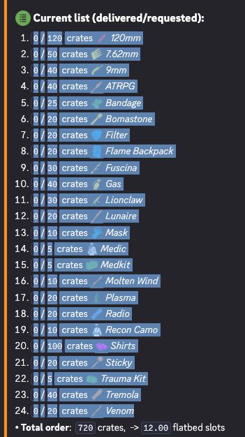

> [!WARNING]
> This repository was heavily **AI-generated** as an experiment and currently in the process of being cleaned up.

# T3C Cargo Organiser

A web application for automatically distributing lend-lease Orders into containers. Primarily for use with T-3C

## How to Use

### 1. Copy the item list from the lend-lease order


### 2. Paste the Copied text into the left input field.
The result should look something like this
```
0/120 crates :LightArtilleryAmmo: 120mm
0/50 crates :RifleAmmo: 7.62mm
0/40 crates :SMGAmmo: 9mm
0/40 crates :ATRPGAmmo: ATRPG
0/25 crates :Bandages: Bandage
0/20 crates :GrenadeC: Bomastone
0/20 crates :GasMaskFilter: Filter
0/20 crates :FlameBackpackC: Flame Backpack
0/30 crates :RifleLightC: Fuscina
0/40 crates :GreenAsh: Gas
0/30 crates :SMGHeavyC: Lionclaw
0/20 crates :GrenadeLauncherC: Lunaire
0/10 crates :GasMask: Mask
0/5 crates :MedicUniformC: Medic
0/5 crates :FirstAidKit: Medkit
0/10 crates :FlameTorchC: Molten Wind
0/20 crates :BloodPlasma: Plasma
0/20 crates :Radio: Radio
0/10 crates :ScoutUniformC: Recon Camo
0/100 crates :SoldierSupplies: Shirts
0/20 crates :StickyBomb: Sticky
0/5 crates :TraumaKit: Trauma Kit
0/40 crates :HELaunchedGrenade: Tremola
0/20 crates :ATRPGC: Venom
```

### 3. Click on "Distribute Items" or press CTRL+Enter
The right panel displays the distribution result.

### 4. Copy Results
Click the "Copy" button to copy the distribution results into your clipboard, ready to be pasted into discord

## Distribution Algorithm

The distribution is relatively simple:

1. Items that can entirely fill up a container are added first
2. Any partial containers are filled to contain as few items as possible
3. Other Items are distributed

If an order requires more than 12 containers (720 crates) an error is returned

## Planned Features
1. Easier copying (by just using copy-text in discord)
2. Different amounts of containers (Allowing for flatbed convoys)
3. Sorting items by category, to allow for containers to ideally be only items of a single category
4. Maybe allowing to directly access LL orders via API (heavily dependent on availability)